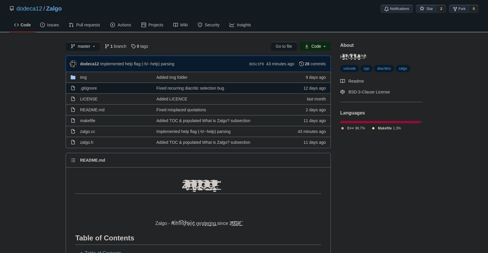
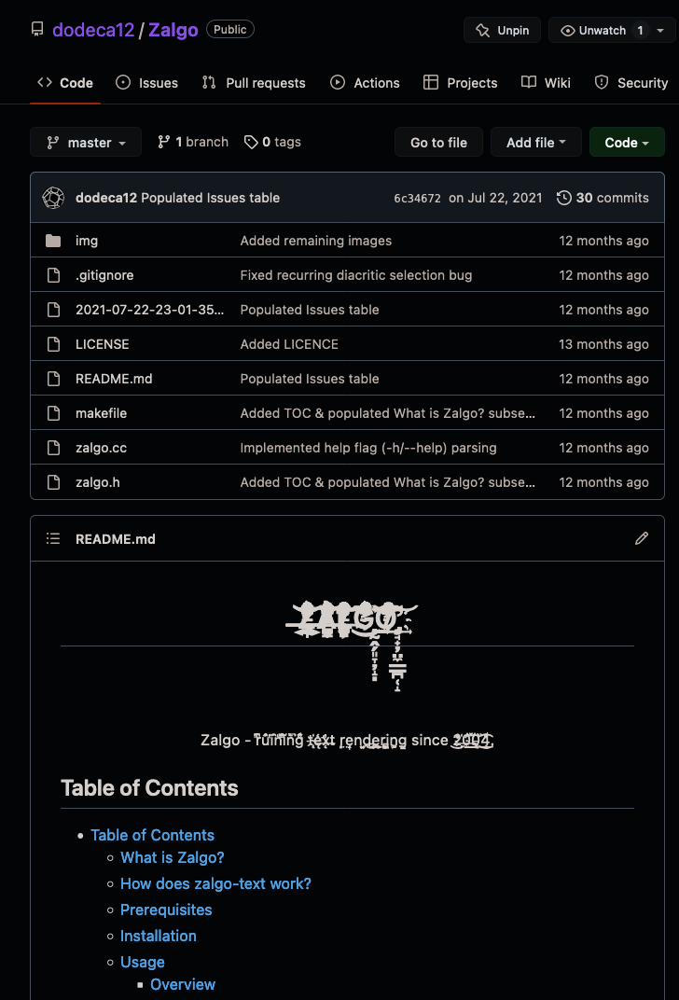
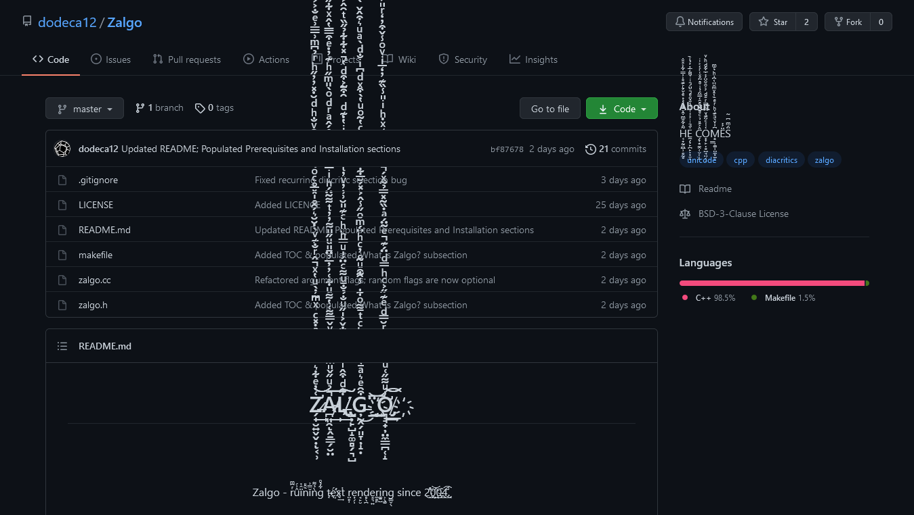
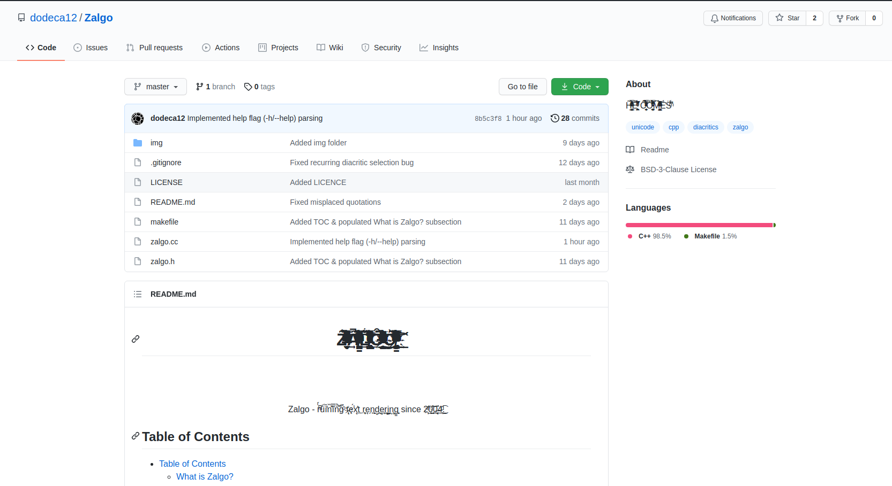
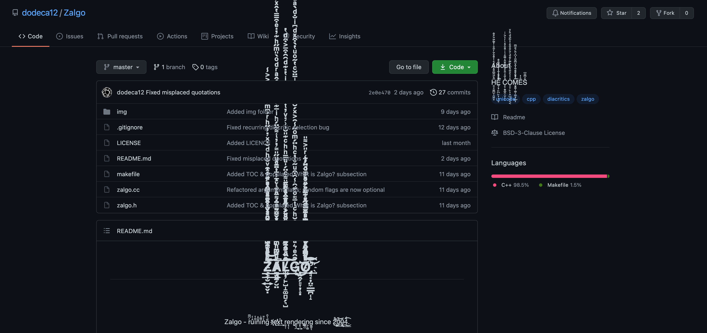
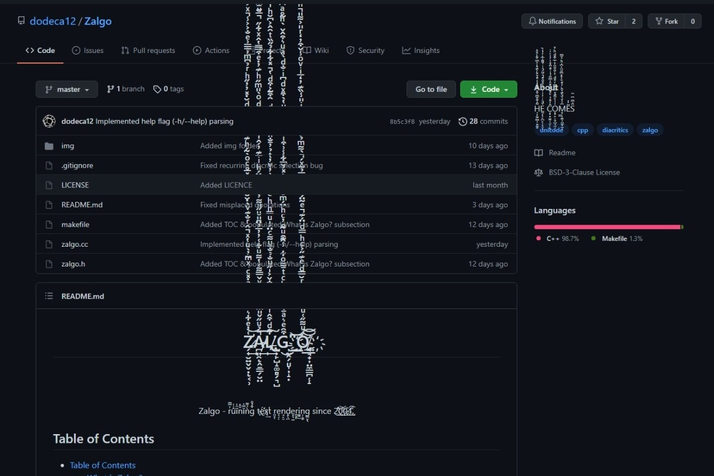

<p align="center">
<h1 align="center">Z̷̶̶̛̗̟̮͍̬̬̣͔̹͑̓ͤ͋͛͂͐́ͪ̊̑ͣ̇̽ͨ͂ͯͫ̓̀ͧ̔ͯ̂ͬ̐͊ͮ̀̇̆̆͛́̑̊̍̽̅̊ͨͦ̀̃́ͪ͊͋͒ͮ̐ͪͩ̆̇̽̓̓̋ͪͬ̉͆ͫ͗̅̿͗ͤ̐͐͐̾ͯ͐ͪ̈ͫ͆̆̍ͨ̾̆̎̓̌̔̑͂̀ͪ͂̓͊͌̇̚̚̚͢͢͢͢͝͝ͅẢ̷̷̴̸̪͈̯̭̱̳̗̮̤ͧ̋̌̎ͫ͐̂̊ͤ́ͮ̌̿͌͑̔͌ͧ͋͑̓̓̅̉̈̄̎ͧ̋̎͌̓̓ͭ͌̃̈́ͪͥ̅͊̓́̂̍ͧ̅̂́̂ͣͬͩͦ̀̎ͫ̋ͪ͊̓̇ͤ͒̿̅̔̂ͯ͋̋͂̅ͧ̄ͫͪ͐͋̈̐͑̅ͭͦ̆ͤ̈͛̅ͭ͑ͨ̅̓ͭͤ́̚̚͢͢͢͞͞ͅL̸̸̶̸̢̢̺̦̙̺̝͚̻̗͉̺͋ͩ͒̂ͥ͋̇ͨͥ̐̌͐̍̋ͧ̐̉̐̄ͧ͌ͨ̈́̍ͧ̿ͪͪͨ͊̎̆͗͗̓ͮ̓ͭ̉̓̄̐ͪ̄ͥ̔̇͊ͩ͂̑͒̄͐͒ͩ̔̽͋͋̉̋̏ͭ̑̂͐͆̆ͪ̍̓̔̿̍͑̈́̃̔̏͑ͤ̄͋͐̉͌̑̄ͨͩ̒̓ͣͤͩ̆ͤ̚̚͘͢͠͠G̶͒̑ͤ͛ͣ̄̔͌ͫͨ̆ͪͨͭ̄͌ͦ͋͂̾̑͒ͧ̃̊̓ͨͪ̈́ͫͦ̋̾̂͐̽́̆̅͋̾͗͒ͥ̄̈̆ͨ̔̃ͦͧ̔̀͒ͯͩ͆ͥ̐ͩ̀ͣͧ͛͒̂̌͂̀ͪ̊ͣ͆̍ͧ͑̆́ͬ̒͂̔͒ͪͨ̆̽ͨͫͨ̒̓͐͊̈̽ͨͦ͆͜҉̦̰̭̗͈̞̦̝̣͘͘͟͟͢͝͞ͅO̸͗ͧ͌̋͑ͧͫͭ̏̏ͫͬ̆̿ͩͤ͊̋͐ͨͪ̿ͩ̈́͊ͤ̃̈́ͣ̇̏̃̽̿̉̃ͯ́̀͌ͫ̉́ͣ͊ͯ̇ͪͥ̎̾̏͊̓̒̅ͥͮͦ̾̌͒̓̒ͬ̎͐͌̎ͪͬ̉̈́̏̊ͨͩ̍ͩͧ̏͒̄̑̊ͧ̄̎ͥ̋͗͊̿̎͋̓́̚̚̚̚͟͝͡҉̡̛͉̘̟̦̤̼̳̪̜̝͢͝</h1>
<br/>
<br/>
<br/>
<p align="center">
    Zalgo - rͬ͆ͫû͗́ï̑̔n̏̑̎ĭ̿͗ǹ̉͌g͋̉ͦ t̴҉̨ę̛́x̨̕͢t r̤͈̹e͎̗̣n̘̙̮d̻̖̪e͓͉͍r̼̻̙i͚̠̺n͕̖͚g̳̬̖ since 2̛ͤ͜҉̦0̰̽͟͢͝0̶̨͔̏͟4͉ͩ͜͟͡.
</p>
</p>

## Table of Contents

- [Table of Contents](#table-of-contents)
  - [What is Zalgo?](#what-is-zalgo)
  - [How does zalgo-text work?](#how-does-zalgo-text-work)
  - [Prerequisites](#prerequisites)
  - [Installation](#installation)
  - [Usage](#usage)
    - [Overview](#overview)
    - [Synopsis](#synopsis)
    - [Argument Flags Description](#argument-flags-description)
    - [Examples](#examples)
    - [~~LICENSE~~ LICENCE](#license-licence)
    - [Issues](#issues)

### What is Zalgo?

[Zalgo Text](https://en.wikipedia.org/wiki/Zalgo_text) ← this Wikipedia article will do a better job than I ever could in explaining Zalgo.  
Besides I'm sure you've come across Zalgo-text at least once on the internet.  

### How does zalgo-text work?

Zalgo-text is generated by leveraging the [Unicode](https://en.wikipedia.org/wiki/Unicode) [diacritical marks](https://en.wikipedia.org/wiki/Diacritic) glyph concatenation hack to generate zalgo-text such as the ever infamous H̢͕̞̠͐̎ͨ͠͡e̶ͪ͐̌͏̢͔̘̰ c̛̓ͨ̇͏̶̗̤ͅo̡̬̘̗̎̑ͮ̀͜ṃ̶̨̪͎̐ͪͧ͞ȩ̧̹͖̹̽͛̾͟s̶̷̟̭̪̿̆͂͞  - a common say among internet image boards when referencing or using zalgo.

Diacritical glyphs concatenation in Unicode escape codes works by concatenating a particular [glyph](https://en.wikipedia.org/wiki/Glyph) of a [grapheme](https://en.wikipedia.org/wiki/Grapheme) (for this example, we use the [Latin alphabet](https://en.wikipedia.org/wiki/Latin_alphabet)) with the glyph of a diacritical mark to create a grapheme with a diacritical mark. Eg: to create the letter é (e with the acute accent), Unicode concatenates the allographic grapheme, e, with  the Unicode escape code, `\u0065`, with the Unicode escape code for ◌́, `\u0301`, to create é with a Unicode escape code of `\u0065\u0301`.  

The Zalgo program uses this feature of Unicode escape code concatenation to repeatedly add diacritical marks to create zalgo-text.

### Prerequisites

Zalgo is implemented in C++. Zalgo can be compiled with both [GCC's g++](https://gcc.gnu.org/) and the [LLVM Clang](https://clang.llvm.org/) compilers.  

Please ensure that either one of the compilers is installed. In most Linux distros usually have GCC installed, and the LLVM Clang compiler is the default compiler on MacOS.  

The [makefile](https://github.com/dodeca12/Zalgo/blob/master/makefile) uses the OS default.

Zalgo only targets *NIX systems, but can be run on [WSL](https://docs.microsoft.com/en-us/windows/wsl/about) for Windows.

### Installation

Installation is easy as

```sh
git clone git@github.com:dodeca12/Zalgo.git
cd Zalgo
make
```

### Usage

#### Overview

Zalgo - a C++ Unicode text polluter  

Zalgo runs on the command line, and as such, uses [UNIX pipes](https://en.wikipedia.org/wiki/Pipeline_(Unix)) and other UNIX stdin streams.  

#### Synopsis

<pre>
zalgo [<b>-h</b> | <b>--help</b> HELP] [<b>-r</b> | <b>--random</b> RANDOM] [PATTERN]
</pre>

#### Argument Flags Description

> ***Note:*** Zalgo performs diacritic concatenation at three locations of a glyph: above (eg: T̿H̽Ê DͣĚÉP̑ ǑN̏EͣS̚), with-in/in-between (eg: T́͘͡H̷̛͟E͢͝͡ D̨̨͞Ȩ͟͏È̸̢P̶͟͞ Ơ͝͝Ń̡̡E̸̷͢S͏̸͡), and below (eg: T̙H͓E̲ DͅE͖ḘP̱ O͍N̗E͔S͕). Each of the previous examples underwent diacritical concatenation of magnitude one (as in only one diacritical mark is added to each glyph).  

> As such, the format of diacritical concatenation is in the form of `^\d{1,}-\d{1,}-\d{1,}` - which corresponds to a regular expression in the form of `ABOVE-MIDDLE-BELOW`.  

Zalgo can be run without any flags. Not passing in any flags will result in a random number between 1 and 10 (inclusive) being selected as magnitude for each of the diacritical locations (`ABOVE-MIDDLE-BELOW`).  

| Flag                                                                     |                                                                                                                                                                                                                                                           Description |
| :----------------------------------------------------------------------- | --------------------------------------------------------------------------------------------------------------------------------------------------------------------------------------------------------------------------------------------------------------------: |
| `-h` or `--help`                                                         |                                                                                                                                                                                                                                         Outputs [synopsis](#Synopsis) |
| `-r` or `--random`                                                       |                                                                                                                                       Selects a random number between 1 and 100 (inclusive) as magnitude for each of the diacritical locations (`ABOVE-MIDDLE-BELOW`) |
| PATTERN (in regex) `^\d{1,}\|(random)-\d{1,}\|(random)-\d{1,}\|(random)` | Use this argument to specify custom magnitudes for each of the diacritical locations (`ABOVE-MIDDLE-BELOW`). `random` can be substituted for a custom magnitude in any and all diacritical locations (where `random` specifies a magnitude between `1-100` inclusive) |

For more clarification on flag usage, please see [examples](#Examples).

#### Examples

Since Zalgo makes uses of `stdio` streams - there are many ways to use Zalgo

- Using UNIX pipes

  ```bash
  $ echo "THE DEEP ONES" | zalgo # No magnitude flag specified, defaulting to random magnitudes for each diacritical location (1 to 10, inclusive)

  T̶̛̛̛̥̦̜̏ͫ͢͜͢͝Hͫͨ͘͟͏̛̛̭͚̫́͘͜Ę̶̶̥̟̤ͥ̊̕͜͜͝͞ D̏̓͝͏͏̸͏̙͖̥́͘͡Ę̸̟̲̲̿̆̀́̀̕͜͝E̸̶̴̢̛̯̟̳̽̔͘͢͟P̴̷̶̹̻͔͐ͮ́͘͠͝͠ O̶̴̧̧̧̙͕̫̾̚͘͡͠N̡̿͐̕͞͏̢̢͖̭͎̕͜Ę̶̴̶̷̛͂͂͟͏̦͎͕S̶̡̢̡̢̬̖̤̾̑́͜͞  # Zalgo-text output

  $ echo "THE DEEP ONES" | zalgo -r # Random flag specified


  
  T̛̞̜̺̹̬̘̞̥͉̣̮͕̖̼̜̱̲̰̦͕̤̥̺̥͙̠͎͙̟͎͖̦̭̰̼̰̮̝̲̠͙͉͕͙̭̖̮͙̰̱͎̱͉̠̳̰̭̫̮̹̞̪̼̬͎̝͔̘̥̟̥̟͙̝̜̝̝̪̙̭͓͇̬͖̥͕̈̈̐̑͆͛̏̔ͤ̀̂̈͒̓ͫ͛ͤ̍̒̚͘ͅͅH̡͇̮̮̠̝͎͖̭̰̖͎̹̩̟͎̦͙̯̫̲̪͇̜̰̘̺̳̱̘̳̙̳̣̱͉̝̪̼̪̺̰̝̠͍̪͎̘̘̥̮̺̭͙̱͕̣͙̤̰̣͍̹̲͍͕̩͇̠͉̗̻̗͚̻͓̙̮̞̱͖̳͖͔̘̹̻͍ͤ͂̿̃̅̓̋͋̊̽̿ͥͤͫͥͫ̃̇͋́̕ͅẺ̟̗͓͕͇̯̩̰̘̮̥̯͈̫̭͙͉͕̪͇̫̞͇̺̺̪͚̦̼̤̰͕̫̫̹̻̼͔̰͖͖͙̮̥̞̫͎̗̰̲̬̮̗̖̗̬͉̪̗͍̺̱̼͉͔̗̟̩͇̖̺̺̯͉̺̰̹͖͎̣̪͔͍̟̑ͪ̓̔ͬ͒ͥͦ̈́̈́̋ͫ͒̒ͦͭͣ̑̚̕͠ͅͅͅͅ D̦͕͕͖͔̤͉̮̭͍͉͇̻̭̟̘͔̟̥̱̰̟̻͎̱̬̟̩̟̬̫̘̦̗̦͓̯̰̭̗̟̗̱̹̠̳̥̬̺̳͕͍̠̰̙̬̟͔͔̹̠͖̼̤̖̱̱̰͖̪͉͓̘͚̟̜̞͍͓̬͕̜̥͗̊̈̌̿̋̉ͣ͋ͨͦ̆ͬ̈́ͭ̅̊̊͑̚͟͠ͅͅͅͅͅE̙͚̫̳͍̲̮͖͎̰̰̘̟͈͕̜͕̞̥͓͉̱̥̥̦̟̩̞̩̥̗̦̭̭͔͚͓̳̳̝̘̺̜̹̦̠̯̮̥̦̟͉̪̤̗̱̲̱̯̼̳̩͙̣͇͍͈̪̫̦̥̠̬͍͚̹̗̟͔̜̬̭̮̭̥͚ͬ̎͒̋̏ͭͤ̋ͩ̾̈́̎̒̓ͪ̇̿ͪͤͩ́͝ͅͅE̱̤̳̻̖̜͉͔̯͚̥̹̰̬̙̩̤̞̖͔̖̬͓̼͇̭̜̠̻͇̙͎͉̮̯̖̟̱̹̼͕̘̫͚̞̬͖͚̗͙̪͕̹̗̦̰̘͈̞͉̺̻̫̫̘̺̟̘̜͉͇̣̻͔͈̹̥̯̳̦̬͕̒̃̾ͦ͐̃ͭ̿͋̾̊̉̉̈́ͬͬͣ̐ͯͣ̕͠ͅͅͅͅͅͅP̷̪̰̙̬͙̻̯̜̪̮̼͔̦͇̮̘͖̳̗̲̗̫̤͖͕̣͕͚̥͓̯̬̜̲͉̘̣̖͚̜̤̮͚̱͙̬̫̻͙̬̞͉͉̭̼̻̟̲̬̤̞͓̺̥̞̞̜̝̟͕̤̭̩̟͙̗̫̦̼̙̰͎͓̤̖̦̼̖͆͑͗̄̎͐ͫͨ͐͊ͣ͗ͣ͆̅̃ͪ͊ͣͨ͢ Ǫ̶̮̰͎̥̱͎̫̞͎͚̟͔̪͓͇͚͔̱̰̺̩͇͍̩̖͉̤̳̜̤̲̲̲̝̹̗͉͙̠̫͇̟̠͓̗͇͍̗̘̦̪͉͔̮͍̻̼̝̲̯͔̠̭̮̥̞̟̥̱̮͈̱̯̤̙͙̥̝̠̬͇̙͎̦̱̀ͫ͗̈ͮ̀ͯ̍ͬͫ͆̆͛ͨ͑̏͛̂ͣ̚ͅͅͅN̛̫̙̜̲̹̟̫͔̰̺̘̩̳̱̣͈̬̜͙̬̟̭̱͉̜̫͎̘̯͉͚͎͓̙̪̭̘̰̘̫̜̜̼̼̺̼̟͍͉̝̣͈̪̰̰̤͔̩̦̩̘̥͖̝̗͕̟̲͙̲̮̗̖̙̮̼̦̗̠̠̖͙̲̰̮͉̝ͨ͋̇ͦͦͯ̈́ͤͤ͋̃̅ͨ͐̍̈́̀ͬͦͣ͝ͅẸ̡͕͙͙̠̤̞͉̞̰̺̭͔̰̲͇̩̱̮̩͎̙̮̲̳͍̞̯̳͓̠̫͈͙̦͈͚̤̱̝͇̜̲̳̬̘̘̰̬̰͍̣̫̗̪͖̺̦̞͚͖̫̩̮̜̬̟̘̺̟̩̹͇̼͚̹̱̯͉̣̗͈̝͔͔͓̯̽̊͌́̑̓ͬ̃ͩ̓͑̃̈́ͣͩ̐̊̄̾̂͜ͅS̛̞̺̳͉̮̫̹͕̰̬̩̪̫͔̻̭̣͕̲̱̗͔̫̲̰͎̙̩̲̗͇͖͇̥̪̘̼̖̫͓̝̰̟̣͖̺͚͎̝̯̻̣̻͚̯͖͍̲̠̜̫͇̖͕̣̝͙̮̞̙̥̦̬̯̥̙͔̖͕̣̥̩͍̦̤ͥ̔͊ͬ̾͌̂̔ͯ͋ͯ͗ͥ̄͂ͨͫ̉̈́̚͞ͅͅͅ # Zalgo-text output


  $ echo "Cthulu" | zalgo 2-0-random
  C̙͈̺̞̜͈͇͕̱͓͈͙̪̫̪̠̻̞̣̪̞̬̼̭̣̠͍̯͇̣̪͓̜̘̫͍̫̟̩̦̱̯̭̣̼̗̝̻̟̜̖̼͉̭̻͚̖̙̯͕͍̩͍̻̼̫̣̼̼̘͚̜̯͚͉̱͕̟̣̟̝̲̭͉̰̭͓͉͕̱̲̔̚ͅͅͅͅͅṭ̼̻͚̩̦̗̥̟̦̖͙͍͖̜̥͕̜̬̮̱͙͇͇̹̯̹̙͎̳̬͍̖̖̲̩̜̫̬̦̼̟̗̤̙͙̩͍̗̰̠̪̮͇̗̖̣̭̙͍͍̥̫͍̙͕͖̣̥̦̥͇̥̦͙̫̗̗̝̘̲̝̭͚͓̤͉͎̼̻̬̮͇͈̖͍͛ͫh͉̣͎̬̥͖̜̺͙͚̲̣̰̼̟̤̦̮͍̜͕̭̦̜̜̗̜̯̗̤̝̖̘̩̥͚̭̼̫̣̼̻̻̼̼͙̙̮͓͉̼̜͔͉͙͚̥̬̣̰̱͎̲̺͔̦̗̪͚̟̩̮̻͚̙̦͚̲̩͇̟̠̳͙̞̩̟̲̜̰͔͖́̈́ͅͅͅͅu̳̩̦͕̥̦̠͖͚̳̣̮̱̱͈̖͙̳̮̙̭̮͍͕̦͇̲̗̖͓͙̘̜͙̳͎̜̹͖̮̜̻̮̹̫͎͎̥̰̤̥͖͉͈̺̦͉̺͖̰̰͎̠̗̺͙̖̹̫͖̖̺̰̬̭̩̻͕̪̜͙̤͔̼͔͙̠̥͔̔͆ͅͅͅͅͅͅͅl̯͇̳̙̠̩͕͍̯͍͎̘̘̟̥̞̺̝̰͇̘̲̫̱̟̙͈̮͈̤̣̠͈̲̦͙͓͚̲̩͈̪̞͍̩̮͉͇̫̤̠̤̳̳͈͈̻̥̟̬̦̞̹͓̰̼͉̝̭̦̤̝̭̬͇̱̺̯̠̣̱̭̠͔͚͈̺̭͎̹̹̙͈͚͖̖̔̓ű̝͎̳̫͈͍̳̤̦̞̱̱͙͎͇̝̼̥͕̰͓̥̫̫̖̙̬̭̫̩̖͇̰̲̰͓͉͍̣̥̙͈̘͍͔̲̥̪͍͙̺̮̟̣̹̣͔͉̟̠̙̟͖̫͇̭̟̦̣͚̪̘̠̻̫͈͖̩̻̩͈̻̙̪̺͙̙͎̝͚͍͓͌ͅͅͅͅ  # Here the Zalgo-text output has a above diacritical magnitude of 2, a middle magnitude of 0, and the below magnitude of a random number between 1 and 100 inclusive


  ```

- Using redirection  
  TODO: Add redirection support

- Fun with pipes  
  Zalgo can be used in conjunction with other commands

  ```bash
  $ echo "The Ancient Ones" | zalgo | cowsay
  __________________
  < T̴̮̟̼͉̥͎̘͙͗̕͘͞͡͝͝ẖ̷̶̡̛̙̩̭̭̦͕ͬ̀͟͠ͅẹ̴̷̢̨̛͕͙̹͙̼͕̾͢͡ͅ A̶̶̶̛̗̻͍̤͖̼͖͔͑̀̕͠n̷̨̟̮͓̹̞̩̥̞̂̕͢͡͠͞c̷̶̶̢̢̻͉̰̪̤̭̠͎ͣ͝͡i̸̡̢̢͔͙̗̖̗̩̣̺ͥ̕͡͞ȩ̴̴̢̹͇̣̺̜̟̭̘ͪ́͘͠n̸̨͑̀́͏̶̶̗̗͈̘̝̱̯͇t̸̷̴͎̭̙͈̬̦̹̯̚̕͘͘͜ O̚͏̶̧͓͓͎͉̝̙̯̼̕͡͠͝n̶̶̿͏̴̸̗̖̹̮̦̞͕͎̀͞ẽ̷̶̷̶͙̤͓̘̜̩̱̥́͢͝s̴̴̷̰͇͓̳̼͇̬̭̚͘͜͠͞ >
  ------------------
          \   ^__^
          \   (oo)\_______
              (__)\       )\/\
                  ||----w |
                  ||     ||
  $ echo "You will be audited for commiting tax fraud." | ./zalgo 2-1-2 | cowsay -f calvin
  _______________________________________
  / Ỵ̫ͬͦ͠o̶̦̹̔̏u̥̰ͬ͛͝ w̶̘̪ͫ̔ị̧̼ͤ͒l͎̱͊̈͘l̨̮̭ͮͯ ḅ͓̉̔͜e̞͓͒̇͞ ả̡̤͎ͧu̺̫͆ͭ͝d̛͍̭ͨ̇ị̸͔̽ͥt̢̞̳ͫ͐e̡̟̗ͬ̿d͒̚͏̜̖ f̛̼̞͂ͬo͚̖ͧ̚͢r̡̹̯͋ͩ c̩͉̅̀͘o̶̳̲̾͂m̶̖̺̏͑m͓ͬͦ͠ͅį̰̟ͧ̾ț̨͎̄͗ȉ͍̼̀͘n̬͈ͨ̏͢g̮̺ͭͮ̀ t̶̤̠͆͌a̧̯̯ͦͧx̶̘̬̀̈ \
  \ f͈̫̔̎͠r̢̖͔͒ͧa͙̹ͭ̈́́u̶̯̮̓ͦd̢͉̜ͣ̿.                                /
  ---------------------------------------
  \                   .,
    \         .      .TR   d'
      \      k,l    .R.b  .t .Je
        \   .P q.   a|.b .f .Z%
            .b .h  .E` # J: 2`     .
        .,.a .E  ,L.M'  ?:b `| ..J9!`.,
        q,.h.M`   `..,   ..,""` ..2"`
        .M, J8`   `:       `   3;
    .    Jk              ...,   `^7"90c.
      j,  ,!     .7"'`j,.|   .n.   ...
    j, 7'     .r`     4:      L   `...
    ..,m.      J`    ..,|..    J`  7TWi
    ..JJ,.:    %    oo      ,. ....,
      .,E      3     7`g.M:    P  41
    JT7"'      O.   .J,;     ``  V"7N.
    G.           ""Q+  .Zu.,!`      Z`
    .9.. .         J&..J!       .  ,:
        7"9a                    JM"!
          .5J.     ..        ..F`
              78a..   `    ..2'
                  J9Ksaw0"'
                .EJ?A...a.
                q...g...gi
                .m...qa..,y:
                .HQFNB&...mm
                ,Z|,m.a.,dp
              .,?f` ,E?:"^7b
              `A| . .F^^7'^4,
              1.MMMMMMMMMMMQzna,
          ...f"A.JdT     J:    Jp,
            `JNa..........A....af`
                `^^^^^'`
  ```

#### ~~LICENSE~~ LICENCE

`Micro` is ~~licensed~~ licenced under the [BSD 3-Clause licence](https://opensource.org/licenses/BSD-3-Clause). For more information, check out [LICENCE](LICENSE).

#### Issues

The "Zalgo-ification" effect of text pollution is heavily dependant on the text-rendering settings of a computer (or application). Many different factors affect the ability and magnitude of the text pollution effect caused by Zalgo - different operating systems, browsers, text/font settings, and even hardware all make Zalgo-text appear different. For example:  

|              | Linux (Ubuntu)                                    | macOS                                           | Windows                                            |
| ------------ | ------------------------------------------------- | ----------------------------------------------- | -------------------------------------------------- |
| **Firefox**  |    |    |   |
| **Chromium** |  |  |  |
